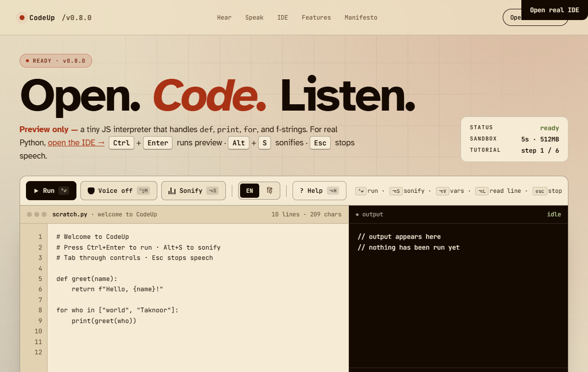
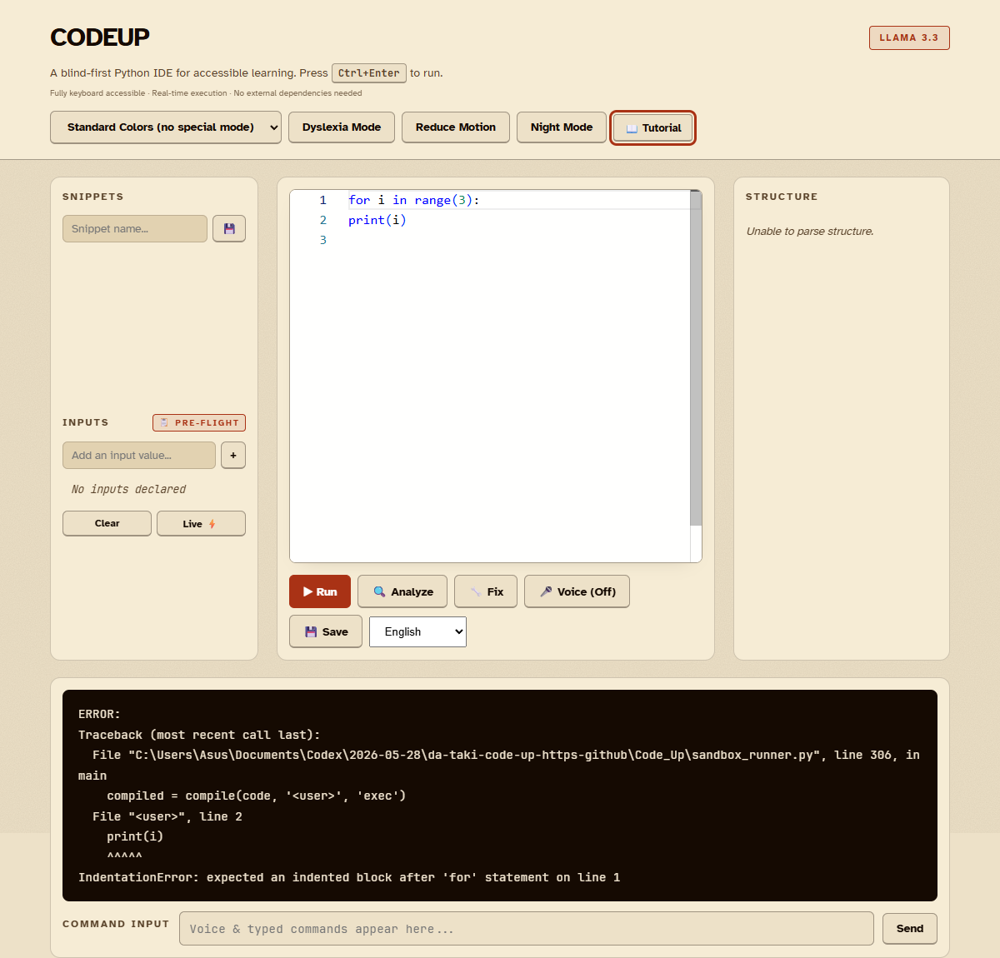
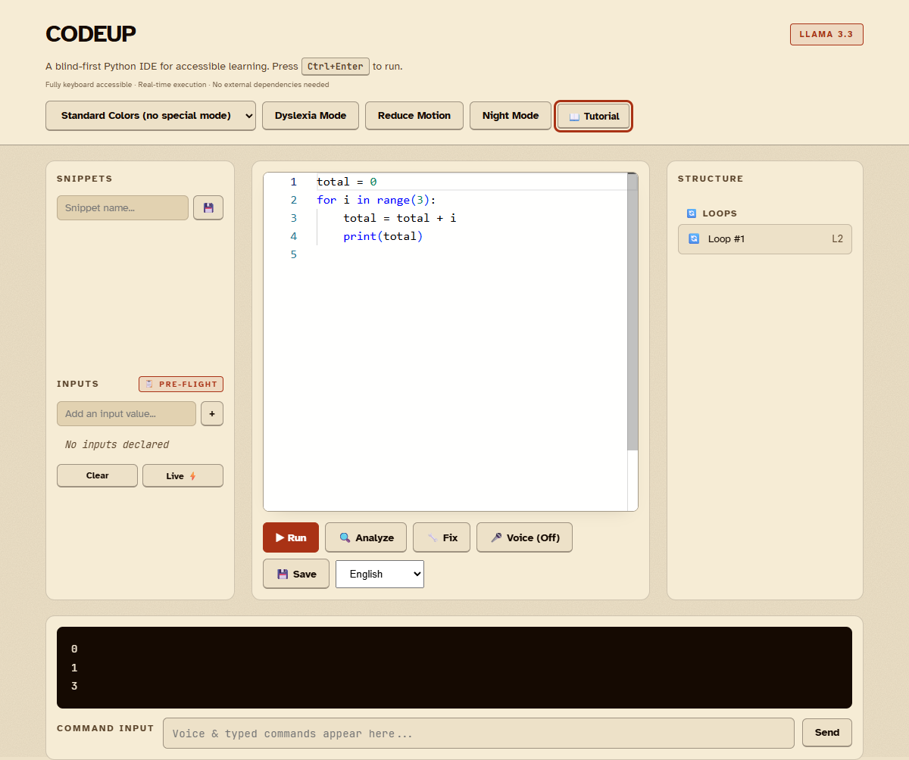

# CodeUp: An Audio-Native Python Learning Environment

[](https://github.com/da-taki/Code_Up/actions/workflows/test.yml)

CodeUp is a blind-first, audio-native Python learning and debugging environment that translates visual programming structure, runtime state and debugging history into spoken, navigable explanations. Students understand indentation and scope through audio code mapping, hear verified variable changes during execution, compare a broken attempt with a corrected program, and receive AI-assisted coaching grounded in deterministic program facts through voice commands, typed commands, or keyboard-driven interaction. Audio Code Map, Step Narration and Mistake Replay retain deterministic fallback output without a cloud API key; AI coaching is optional.

The project is independently developed and in active use at the **School for the Blind and Deaf, Patiala**, where coding sessions are conducted twice monthly.

> **Sister project:** CodeUp Web extends the same accessibility model to HTML and CSS. See [Code_Up_Web](https://github.com/da-taki/CodeUp-web) (in active development).

---

## Flagship Capabilities

### Audio Code Map

Derives program structure from deterministic Python AST analysis. Students hear loops, conditions, functions, statements after blocks and nesting depth without reading every line. Sub-queries like "what is inside the loop" and "what comes after the loop" return precise, line-numbered answers.

### Variable Watch + Step Narration

Runs code within the existing sandboxed execution environment and narrates actual traced variable updates and output. Values are derived from execution traces, not guessed by AI. Students say `watch total` to focus narration on specific variables, then `run with step narration` to hear each change as it happens.

### Conditional Audio Breakpoints

Lets students pause narrated execution when a traced variable reaches a numeric condition, such as `pause when total becomes greater than 10` or `pause when score equals 6`. The pause explanation uses the stored trace value, `why did it pause` repeats the verified reason, and `continue execution` resumes from the stored trace.

### Mistake Replay

Compares a recent failed attempt with a corrected successful run. Explains structural differences, such as moving an assignment inside a loop, and why behaviour changes. The comparison is built from deterministic diff and AST analysis, with optional AI rephrasing for beginner-friendliness.

### AI-Assisted Coaching

Groq (Llama 3.3 70B) enhances explanations for clarity and beginner-friendliness. Deterministic AST, trace and diff facts remain the source of truth; AI rephrases verified facts and never invents them. When cloud AI is unavailable, every feature falls back to its deterministic output. A local Ollama fallback is also supported.

### Accessibility-First Interaction

Typed commands, keyboard-accessible controls, spoken output and narration, and voice-command routing in English and Hindi. All buttons have ARIA labels and are keyboard-reachable. Output appears in `aria-live` regions. Press `Escape` at any time to stop speech.

### Guided Tutorial (audio-first, opt-in)

A spoken, conversational, activity-based tutorial that lets a blind beginner learn basic Python independently. It teaches five modules in order — **print statements → variables → if statements → for loops → while loops** — but is fully **opt-in and modular**: after *every* module the learner is asked whether to continue, practise again, hear a recap, or stop and start coding. Finishing one topic never forces the next.

Each module is short: a spoken explanation, then a real **voice-driven construction** activity. The tutorial tells the learner an exact command to say — beginning with `insert …` — they say it (or type the same command into the command box), and CodeUp's normal voice pipeline inserts the Python and reads it back. Programs are built line by line by speaking, never by typing Python into the editor. The finished program is validated structurally (so many different correct answers are accepted, not one scripted string), and the learner gets spoken success feedback or spoken hints. Every essential event — orientation, explanation, the command to say, each inserted line, run output, success, errors, hints, choices, and exit — is spoken through CodeUp's real, proven speech pipeline (the same one that speaks program output), not just shown on screen. See [Guided Tutorial](#guided-tutorial) below for commands and design.

---

## Flagship Demo Flow

Start with this broken program:

```python
total = 0
for i in range(3):
total = total + i
print(total)
```

| Step | Command | What the student hears |
|------|---------|----------------------|
| 1 | **Run** | Beginner-friendly explanation: the line after the loop must be indented with four spaces |
| 2 | `give me a code map` | "Your code has a syntax error near line 3. Here is what I can tell from indentation alone." |
| 3 | Fix indentation → `    total = total + i` | Not applicable |
| 4 | `watch total` | "Now watching total." |
| 5 | `run with step narration` | "total becomes 0 … total changes to 1 … total changes to 3. Output: 3" |
| 6 | `compare before and after` | "Line 3 was indented from 0 to 4 spaces, changing what block it belongs to." + explanation of why the fix works |

The student identifies the scope problem, traces `total` as it changes through loop execution, and understands the fix relative to their earlier mistake.

---

## Supported Commands

Many natural variations work because the intent parser is grammar-based, not exact-match.

| Purpose | Example commands |
|---------|-----------------|
| Understand structure | `code map`, `give me a code map`, `what is inside the loop`, `what comes after the loop`, `how deeply nested am I`, `list my functions` |
| Trace execution | `watch total`, `track score`, `clear watched variables`, `run with step narration`, `what changed in this step` |
| Learn from mistakes | `compare before and after`, `replay my mistake`, `why does the fixed version work`, `show changed lines` |
| Run and debug | `run`, `execute code`, `set breakpoint at line 10`, `pause when total becomes greater than 10`, `why did it pause`, `continue`, `next step`, `previous step` |
| Navigate code | `go to line twenty five`, `read line three`, `find variable x`, `where am i` |
| Audio features | `sonify block`, `tell the story`, `what's different` |
| AI assistance | `fix`, `analyze`, `explain simply`, `generate code for fibonacci`, `learning mode`, `quiz me on loops` |
| Guided tutorial | `start tutorial`, `practise for loops`, the `insert …` command shown for each step, `run code`, and (while in the tutorial) `continue`, `try again`, `recap`, `hint`, `read my code`, `give me an example`, `repeat`, `exit tutorial` |
| Hindi | `चलाओ` (run), `कोड समझाओ` (analyze), `कोड ठीक करो` (fix), `लाइन बीस पर जाओ` (go to line 20), `मदद` (help) |

Hindi number words 0–100 are recognized in line-navigation commands.

---

## Multi-File Projects

CodeUp can run either the original single-file editor flow or a session-scoped multi-file project. A project is stored in the sandbox workspace under a clear `project/` root with a lightweight `codeup.project.json` manifest, an entry file such as `main.py`, a current active file, a file list, and inferred requirements.

Useful project commands work by voice or by typing in the command box:

| Purpose | Example commands |
|---|---|
| Generate a project | `create a quiz game split into multiple files`, `make a student marks analysis project using pandas`, `make a numpy statistics project with tests` |
| Read files | `read project files`, `file tree`, `explain project structure` |
| Open files | `open main dot py`, `open utils dot py`, `open data slash marks dot csv` |
| Edit files | `create file data loader dot py`, `rename this file to analysis dot py`, `delete this file` |
| Run files | `run main dot py`, `run tests slash test main dot py` |
| Dependencies | `explain requirements` |

Running a project file executes from the project root, so imports like `from utils import helper` work naturally. The sandbox allows safe beginner imports such as `math`, `random`, `statistics`, `datetime`, `json`, `csv`, `pathlib`, `typing`, `collections`, `itertools`, plus `numpy`, `pandas`, and `matplotlib` when installed. High-risk imports such as `os`, `sys`, `subprocess`, `importlib`, shell execution, and outside-root file paths remain blocked.

When a generated project uses third-party packages, CodeUp writes or updates `requirements.txt` and includes those packages in the project manifest. If a package is missing, the run error says which dependency is missing and points the student to `requirements.txt`. To return to the original demo-safe single-file flow, load a demo or snippet, clear the editor, or start with the default `print("Hello CodeUp!")` code without creating a project.

---

## Guided Tutorial

A spoken, activity-based tutorial that walks a blind beginner through writing and running their first Python programs, entirely by ear and keyboard.

### What it does

It teaches five modules **in order** — print statements, variables, if statements, for loops, while loops — but progression is **always opt-in**. After every module you are asked what to do next; finishing print statements never forces you into variables.

The tutorial teaches CodeUp's actual **voice-driven coding workflow**, not a visual editor with narration. In each module it: (1) explains the concept aloud; (2) gives you an exact spoken command to say, beginning with `insert …`; (3) you say it — or type the same command into the command box as a keyboard fallback; (4) the command is handled by CodeUp's *normal* voice-command pipeline, which (5) inserts the Python and (6) reads the inserted line back to you; (7) the tutorial confirms the structure and prompts the next line; (8) when the program is complete you say `run code`; (9) output and success are spoken; (10) only then are you offered recap / practise again / continue / exit. You never have to type Python directly into the editor.

Multi-line constructs are built **line by line** so you hear the structure (especially indentation) as it forms. The finished program is validated by structure (using Python's AST), so many different correct answers are accepted — `print("hi")`, `name = "Aman"` then `print(name)`, `score = 7` then `print(score)`, and so on all work. You hear spoken success feedback when it works and spoken hints when it doesn't.

### The `insert …` commands each module teaches

Say these (or type them into the command box). They are ordinary CodeUp voice commands — they work the same after you leave the tutorial.

| Module | Commands the tutorial guides you to say |
|---|---|
| Print | `insert print hello world` → `print("hello world")` |
| Variables | `insert a variable named name and give it the value Taknoor` → `name = "Taknoor"`, then `insert print name` → `print(name)` |
| If | `insert a variable named age and give it the value 12`, `insert an if statement checking age is greater than 10`, `insert an indented print saying you can vote` |
| For | `insert for i in range 3`, `insert an indented print i` |
| While | `insert a variable named count and give it the value 1`, `insert while count is less than or equal to 3`, `insert an indented print count`, `insert an indented count equals count plus 1` |

A spoken word value becomes a quoted string (`Taknoor` → `"Taknoor"`); a number stays a number (`12` → `12`). Spoken comparisons become real operators (`is greater than` → `>`, `is less than or equal to` → `<=`). The word `indented` adds the four spaces that put a line inside an `if`, `for`, or `while`.

### How to start

- **Keyboard / mouse:** press the **📖 Tutorial** button in the header (Tab reaches it after the start screen).
- **Voice or typed command:** say or type `start tutorial` (or just `tutorial`). Jump to one topic with `practise for loops`, `practise variables`, etc.

### Commands during the tutorial

All of these work by voice **or** the typed command box, and each also has a keyboard-reachable button in the tutorial panel:

| You can say / type | What happens |
|---|---|
| `insert …` (the command shown for the step) | Inserts the next line through the normal voice pipeline and reads it back |
| `run code` (or `Ctrl+Enter`) | Run your program (normal IDE command, works as always) |
| `read my code` | Hear your program read back line by line, with indentation announced |
| `continue` / `next` | Move on to the next topic (only offered after you succeed) |
| `try again` / `practise again` | Repeat the current activity from a clean editor |
| `recap` | Hear a short summary of the current topic |
| `hint` | Hear a hint for the exact step you are on |
| `give me an example` | Fill a worked example in for you to run |
| `repeat` | Hear the current step's command again |
| `exit tutorial` / `start coding` | Leave the tutorial cleanly and return to free coding |

Crucially, **real coding commands are never swallowed by the tutorial.** `insert …`, `run code`, `read line 2`, `what variables`, navigation, and every other IDE command flow through to the normal CodeUp pipeline while the tutorial is active — the tutorial only intercepts its own control words (`continue`, `repeat`, `hint`, `recap`, `practise again`, `read my code`, `exit tutorial`) and observes the resulting insertions.

### Modules and optional progression

`print → variables → if → for → while`. After each module you choose **continue / practise again / recap / exit**. Completed modules are remembered in `localStorage`, and you can restart from the beginning (`start tutorial`) or jump to any topic (`practise <topic>`) at any time. The final while-loop module includes a static safety check that warns about obviously non-terminating loops before running; the sandbox's 3-second wall-clock timeout is the real backstop.

### Accessibility design

- **Speech is the primary channel.** Every essential event is spoken through the same proven `speak()` → Web Speech API path that speaks program output — never text-only. Examples are loaded with `{preserveSpeech: true}` so narration is never silently cancelled.
- **Keyboard is a first-class fallback.** The panel uses semantic HTML (`role="complementary"`, `aria-live` status), every control is a real focusable `<button>` with a visible focus ring, and the whole flow can be completed without a mouse or microphone.
- **The visual panel is supportive, never required.** A sighted teacher can follow along on screen, but nothing in it is needed to understand or finish the tutorial.

### How developers test it

- Backend lesson content + AST validators + while-loop safety: `tests/test_tutorial_engine.py`
- Routes (`/tutorial/modules`, `/tutorial/validate`) and command routing: `tests/test_tutorial_routes.py`
- Voice-insert pipeline (`insert_variable` / `insert_while` / general `insert`, voice-first lesson content): `tests/test_tutorial_insert_pipeline.py`
- Pure state-machine transitions **and staged build-step checks** (run with Node): `tests/tutorial_model.test.js`
- Spoken-code normalizers — string vs number quoting, conditions, indentation (run with Node): `tests/spoken_code.test.js`
- Frontend wiring + proof the tutorial speaks via the real path and is voice-first: `tests/test_tutorial_frontend.py`

```
python -m pytest tests/test_tutorial_engine.py tests/test_tutorial_routes.py tests/test_tutorial_insert_pipeline.py tests/test_tutorial_frontend.py -q
node tests/tutorial_model.test.js
node tests/spoken_code.test.js
```

The lesson content and validators live in `tutorial_engine.py` (one source of truth, served to the frontend by `/tutorial/modules`). The frontend controller is `static/tutorial.js`.

---

## How It Works

| Layer | Mechanism |
|-------|-----------|
| **Structural analysis** | Python `ast` module parses code into loops, conditions, functions, assignments and nesting depth. Syntax errors fall back to indentation-based heuristics. |
| **Runtime tracing** | Code runs in a sandboxed subprocess with a `sys.settrace` callback that records variable initializations, changes and function calls. Values come from actual execution, never AI. |
| **Conditional audio breakpoints** | Session-scoped breakpoint rules compare traced variable values against numeric thresholds. Conditions reject arbitrary expressions and pause only on verified trace events. |
| **Mistake Replay** | Session-scoped snapshots store the most recent failed and successful code. `difflib.SequenceMatcher` computes line-level changes; AST comparison identifies structural shifts like indentation scope changes. |
| **AI coaching** | Groq rephrases deterministic facts into student-friendly spoken summaries. System prompts instruct the model not to invent structural facts or variable values. |
| **Deterministic fallback** | When AI is unavailable (no key, network error, disabled), every feature returns its raw deterministic output. No feature depends on AI for correctness. |

---

## Screenshots

| Landing page | IDE with spoken debug | Sonification and trace |
|---|---|---|
|  |  |  |

---

## Quickstart

Requirements: Python 3.8 or newer. The IDE runs offline once installed. Monaco, JetBrains Mono, and Atkinson Hyperlegible are all vendored. The landing page additionally requires a one-time Node build (see "Building the landing page" below).

Clone and set up a virtualenv:

    git clone https://github.com/da-taki/Code_Up.git
    cd Code_Up
    python -m venv .venv

On Windows PowerShell, use the Python launcher if `python` is not on PATH:

    py -m venv .venv

Activate the virtualenv (Windows PowerShell):

    .\.venv\Scripts\Activate.ps1

Activate the virtualenv (macOS / Linux):

    source .venv/bin/activate

Install dependencies:

    python -m pip install -r requirements.txt

Configure environment:

    cp .env.example .env

Edit `.env` and set at minimum:

    FLASK_SECRET_KEY=<a random secret>
    GROQ_API_KEY=<your free key from https://console.groq.com>

If you don't set a Groq key, AI features return a clear spoken message rather than crashing. To disable AI entirely, set `GEMINI_ENABLED=0`.

### Optional: Offline AI via Ollama

CodeUp can fall back to a locally-running Ollama instance when Groq is unavailable (no internet, no API key, rate-limited). To enable:

1. Install Ollama from <https://ollama.com>
2. Pull a small model: `ollama pull llama3.2:3b`
3. Set environment variables in `.env`:

       OLLAMA_ENABLED=1
       OLLAMA_URL=http://localhost:11434
       OLLAMA_MODEL=llama3.2:3b

When enabled, Groq is tried first. On any failure (network, auth, rate-limit), CodeUp transparently routes to Ollama and prefixes responses with `[offline mode]` so the user knows.

Run the application:

    python app.py

Open `http://127.0.0.1:5000` in Chrome or Edge. (Firefox does not support the Web Speech API for voice input. Keyboard and the typed command box still work in any browser.)

Run tests:

    pip install -r requirements-dev.txt
    python -m pytest -q

Tests are fully isolated. Snippet storage redirects to a temp directory and no real AI calls are made.

---

## Validation Status

| Check | Result |
|-------|--------|
| Automated tests | 699 passed, 1 skipped |
| Python compile check | Clean |
| Ruff lint | Clean |
| JavaScript syntax checks | Clean |
| Frontend build | Clean |
| Audio Code Map (browser) | Verified: deterministic AST facts and AI-enhanced output |
| Step Narration (browser) | Verified: correct traced variable values |
| Mistake Replay (browser) | Verified: correct diff and indentation/scope explanation |
| Groq-backed enhancement | Verified: AI rephrases without inventing facts |
| Offline/deterministic fallback | Verified: all three features return correct deterministic output |
| Secret/API-key scan | No leakage found in responses, console, or tracked files |

> **Limitations not yet independently validated:** physical microphone capture for all new commands, NVDA/JAWS/VoiceOver screen reader testing of the new controls, and physical mobile-device accessibility.

---

## Status and Adoption

**v0.8.0**, classroom-pilot ready.

### Pilot results

CodeUp has been piloted with 10 users to date:

- 7 users rated it 10/10
- 3 users rated it between 7.5/10 and 8.5/10
- Full anonymized pilot table: [docs/pilot-results.md](docs/pilot-results.md)

The project is in active use at the **School for the Blind and Deaf, Patiala**, where it is used in twice-monthly coding sessions.

### Evaluation metrics

The pilot and future classroom tests track:

- Task completion rate
- Time to fix first error
- Commands recognized correctly
- Number of sighted-assistance interventions
- User confidence rating before and after the session

See [docs/pilot-results.md](docs/pilot-results.md) for the current anonymized table.

---

## Architecture

### Backend (`app.py`)

Flask application handling code execution, AST-based analysis, voice intent parsing, and AI proxying. Each `/run` request spawns a fresh subprocess confined to a per-session workspace directory, with restricted built-ins and (on POSIX systems) `RLIMIT_AS` and `RLIMIT_CPU` enforced via `preexec_fn`. Per-session state (execution traces, snippets, watched variables, mistake snapshots, sandboxes) is keyed by signed session cookies.

### Frontend

Monaco Editor (vendored locally, no CDN dependency), JavaScript using the Web Speech API for voice recognition and `SpeechSynthesisUtterance` for output, Web Audio API for sonification. Speech recognition language switches automatically between `en-US` and `hi-IN` based on the selected interface language.

### Supporting modules

| File | Purpose |
|---|---|
| `intent_parser.py` | Natural language to structured intent and slots, with Hindi number support |
| `structure_parser.py` | AST-based code structure extraction (functions, classes, loops, async detection, parent class tracking) |
| `tutorial_engine.py` | Guided-tutorial lesson content + AST-based activity validators + while-loop safety check |
| `sandboxed_fs.py` | Per-session restricted workspace file system |

---

## Sandbox

User code runs in a separate Python subprocess with:

- Restricted imports: only `math`, `random`, `string`, `datetime` allowed
- Restricted built-ins: `eval`, `exec`, `compile`, `open`, `__import__`, and direct module attribute access blocked
- 3-second wall-clock timeout
- 5,000-event trace cap to prevent runaway memory growth
- POSIX-only: 128 MB address space cap and 3-second CPU time cap via `setrlimit`
- Working directory confined to a per-session temp workspace
- `input()` blocked with a clear explanation suggesting hardcoded values

The wall-clock timeout stops slow or sleeping programs. The POSIX CPU cap stops tight loops that burn processor time before wall-clock timeout would otherwise fire.

Per-session rate limit: 30 runs per 60 seconds.

---

## Environment Variables

| Variable | Required | Default | Description |
|---|---|---|---|
| `FLASK_SECRET_KEY` | Yes | `dev-secret-key-change-in-production` | Signs session cookies |
| `GROQ_API_KEY` | No |  | Enables AI features (get free at console.groq.com) |
| `GEMINI_ENABLED` | No | `1` | Set `0` to disable all AI calls (env var name kept for backward compat) |
| `SESSION_COOKIE_SECURE` | No | `false` | Set `true` behind HTTPS |
| `DATA_DIR` | No | `.` | Directory for per-session snippet files |
| `OLLAMA_ENABLED` | No | `0` | Set `1` to enable local Ollama fallback when Groq fails |
| `OLLAMA_URL` | No | `http://localhost:11434` | Ollama server URL |
| `OLLAMA_MODEL` | No | `llama3.2:3b` | Ollama model name |

---

## Keyboard Shortcuts

| Shortcut | Action |
|---|---|
| `Ctrl+Enter` | Run code |
| `Escape` | Stop speech immediately |
| `Alt+S` | Sonify current block |
| `Alt+L` | Read current line with context |
| `Alt+V` | List variables in scope |
| `Alt+E` | Check for syntax errors |
| `Alt+H` | Show help / command list |
| `Alt+N` | Next execution trace step |
| `Alt+Left` / `Alt+Right` | Navigate history |
| `Alt+Home` / `Alt+End` | Jump to top / bottom |
| `Ctrl+Shift+P` | Open command palette |
| `Ctrl+Shift+M` | Toggle voice control |
| `Alt+A` | Cycle color vision modes |
| `Alt+D` | Toggle dyslexia mode |
| `Alt+M` | Toggle reduced motion |

---

## Accessibility

- Screen-reader-oriented output through `aria-live` regions and keyboard-accessible controls; direct NVDA, JAWS and VoiceOver validation is still pending.
- Color vision modes (Protanopia, Deuteranopia, Tritanopia)
- High Contrast mode
- Night Mode for low-light environments
- Dyslexia-friendly mode with Atkinson Hyperlegible font and increased line spacing
- Reduced motion support, both via in-app toggle and the OS-level `prefers-reduced-motion` setting
- Full keyboard navigation: every feature reachable without a mouse
- No `window.prompt()`. All dialogs use accessible inline modals with focus management

---

## Demo and Teaching Materials

- One-command demo flow: [DEMO_FLOW.md](DEMO_FLOW.md)
- Accessibility test checklist: [ACCESSIBILITY_TESTING.md](ACCESSIBILITY_TESTING.md)
- Teacher guide: [docs/teacher-guide.md](docs/teacher-guide.md)
- Beginner lessons: [lesson 1](lessons/lesson_1_print.md), [lesson 2](lessons/lesson_2_variables.md), [lesson 3](lessons/lesson_3_loops.md)
- Security model: [SECURITY.md](SECURITY.md)

---

## Known Limitations

- Chrome and Edge are best for speech recognition. Firefox has limited Web Speech API support, so keyboard and typed commands are the fallback there.
- Live `input()` mode is POSIX-only. The pre-flight input panel works across platforms.
- POSIX CPU and memory caps are stronger than the Windows fallback.
- AI help is optional and depends on Groq or Ollama when enabled. Core run, trace, sonification, and navigation features do not require AI.
- The sandbox is intended for classroom and demo use, not as a public multi-tenant judge service.

---

## Landing Page

The marketing landing page at `/` is a separate React experience that walks visitors through the core ideas before they reach the IDE. It includes a sonification demo, voice typewriter, IDE preview, and features grid. The landing page is fully keyboard navigable and respects `prefers-reduced-motion`.

The IDE at `/ide` works without any Node tooling. The repository includes built landing-page assets, so a clean clone can start Flask immediately. Rebuild only if you edit `static/landing/*.jsx`.

### Building the landing page

    npm install
    npm run build

This produces `static/vendor/react/*.min.js` and `static/landing/dist/bundle.js`. Node is only required for the landing page.

---

## What's New in 0.8.0

- **Guided Tutorial**: spoken, opt-in, activity-based lessons (print → variables → if → for → while) with structural answer validation, spoken hints, and per-module continue/practise/recap/exit choices — see [Guided Tutorial](#guided-tutorial)
- **Audio Code Map**: hear program structure from deterministic AST analysis
- **Variable Watch + Step Narration**: trace verified runtime variable changes during execution
- **Mistake Replay**: compare broken and fixed code with structural diff explanation
- **`input()` support**: pre-flight inputs panel and live input mode (POSIX only)
- **Output diff narration**: re-run code and hear only what changed
- **Audio heartbeat**: soft tone every 500ms while code runs
- **Voice macros**: `remember this as quick sort` / `use macro quick sort`
- **Output bookmarks**: `bookmark this` / `read from bookmark <name>`
- **Breadcrumbs**: Alt+B reads "function calculate, inside for loop, line 15"
- **Beginner errors**: `explain simply` for jargon-free error explanations
- **Auto-save**: every 30 seconds, with draft restoration on next visit

---

## License

MIT. See `LICENSE`.

---

## Author

Independent project by Taknoor Singh ([@da-taki](https://github.com/da-taki)).
